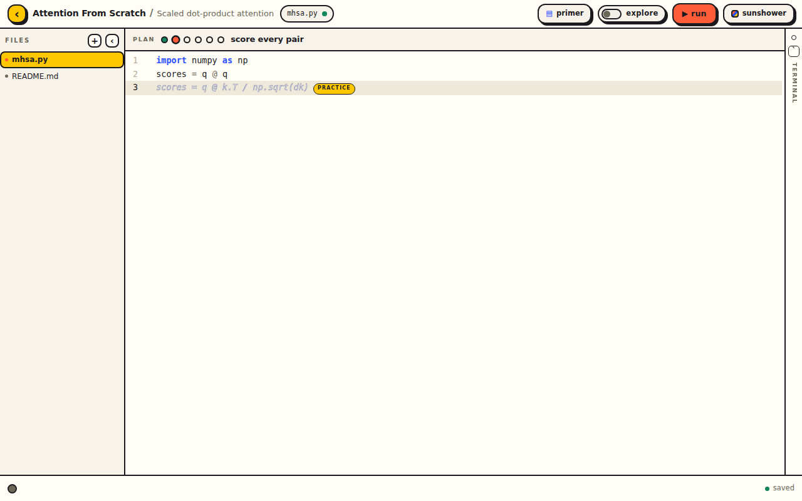
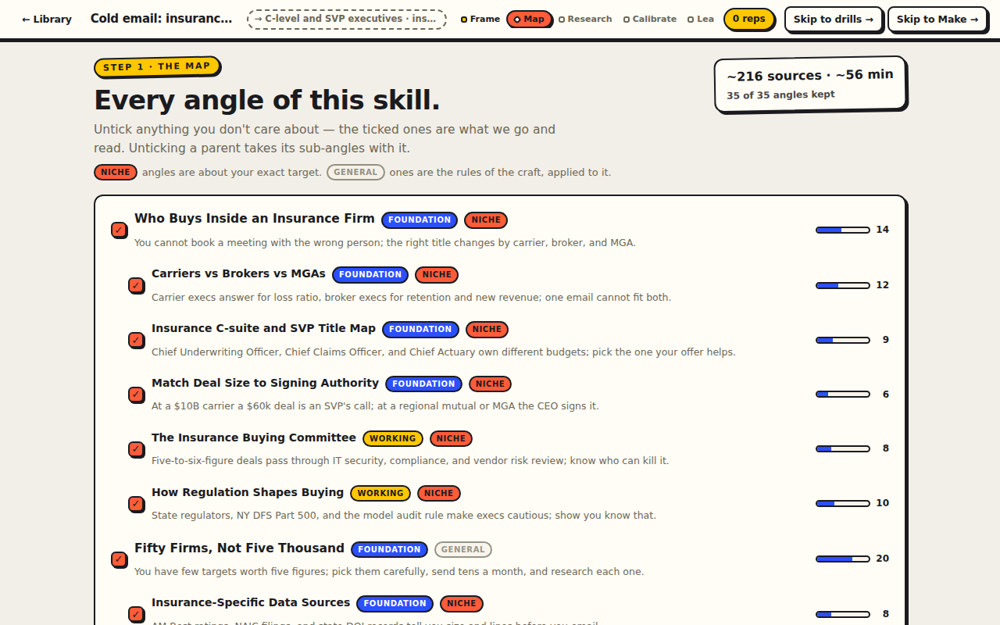
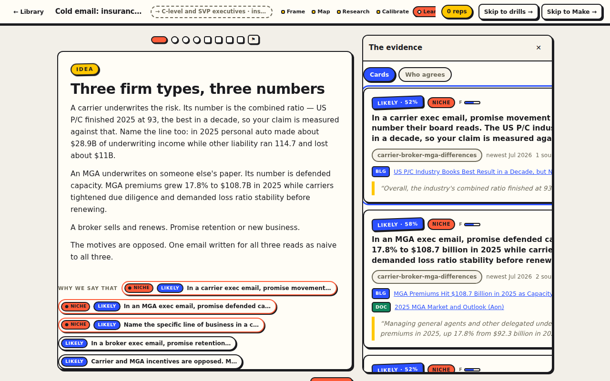
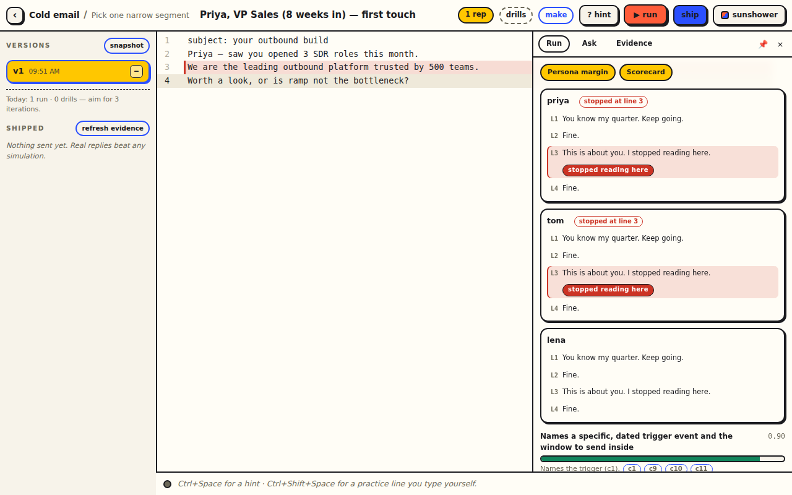

<p align="center">
  
</p>

<p align="center">
  <a href="LICENSE"></a>
  
  
</p>

A local learning app for the AI era. Two tracks, one rule: **you do the work,
the AI only guides.**

- **Code**: pick a real goal ("multi-head attention in numpy from scratch", "my
  own BPE tokenizer"), an instructor agent teaches *just enough*, and you write
  **every line yourself** in a native editor. Ghost lines you can't Tab-accept,
  hints on demand, a watcher that respects struggle.
- **Skills**: learn anything that isn't code (cold email, app marketing, ads) from
  a course an agent crew researches on the open web, with every claim tagged by
  trust, recency, soundness and how close it is to *your* niche. Then drill,
  make the real thing, run it against simulated readers, ship it, feed the real
  numbers back.

Everything generates through the **Claude Code CLI** on your own Claude
subscription. No API keys, no accounts, no server but yours. Data is plain
files in `data/`.

<p align="center">
  
  
</p>
<p align="center">
  
  
</p>

## Quick start

```bash
git clone https://github.com/BrickleRex/omnilearn.git && cd omnilearn
npm install
npm run seed:skills   # optional: two finished, real courses to explore right away
npm run dev           # server :4650 + web :4652  → open http://localhost:4652
```

You need:

- **Node 22+**.
- The **Claude Code CLI** installed and logged in (`claude` on PATH). Every
  generation is a `claude -p` call billed to your subscription. Web research
  uses the CLI's own WebSearch/WebFetch tools.
- For the code track, either `python3` or [`uv`](https://docs.astral.sh/uv/) on
  PATH. The runner is `auto`: plain python for plain scripts, `uv run` when the
  project has a `pyproject.toml`/`uv.lock`, when a script carries PEP 723 inline
  deps, or when python isn't on PATH. Completions come from a local
  [jedi](https://github.com/davidhalter/jedi) daemon; if jedi isn't importable it
  runs itself through `uv run --with jedi`.

## The Code track

- **Calibrate → Primer → Build → Reflect** per milestone; the primer ends itself
  the moment every concept is cleared, and you can re-read it any time.
- **Ghost lines you can't Tab-accept** (`Ctrl+Shift+Space`): one hollow line of
  code that only enters the file through your own fingers.
- **Hints on demand** (`Ctrl+Space`): the next precise step in 1–2 plain lines;
  again for the composite step. Hints also look back and flag at most one thing
  in your earlier code that is unambiguously wrong; plausible experiments stay
  unflagged.
- **A watcher that respects struggle**: quiet by default, an amber gutter dot
  only when you're genuinely rabbit-holing, silent in explore mode (`Alt+E`).
- **A terminal that manages its own presence**: a translucent rail that springs
  open on run output and folds itself away (`` Ctrl+` ``), a real shell tab, and
  an **Ask** tab (`Ctrl+/`) with a concise tutor who knows your project, file,
  and last run. It explains; it never dumps code.
- **Real intellisense** from jedi (static analysis, ~50 ms, knows `np.zeros`),
  never an LLM.
- **Inspire me**: five varied project ideas, refreshable, and any idea can seed
  five more in its spirit.
- Playroom visual identity with four schemes (two light, two dark).

## The Skills track

Flip the Library to **Skills**. Nine beats per skill: Frame → Map → Research →
Calibrate → Learn → Drill → Make → Ship → Refresh.

**Research crew** (all through the CLI): a *Cartographer* maps every angle of
the skill into an **outline ladder** you prune; *Scouts* search the web per
angle (Reddit, X via the public syndication endpoint, YouTube transcripts,
blogs, docs, public Facebook posts where reachable) and the server enriches
each source with its full text; an *Assessor* scores reputation, soundness and
recency (decay horizons differ per angle: deliverability rots fast, psychology
slowly); a *Reconciler* merges duplicates and marks contested claims with both
sides; an *Architect* builds modules, rationed units (≤120 words), rubrics that
cite claims, three personas built from the corpus, exemplars, and drills.
Evidence stays one click away as **index cards** and a **consensus grid**.

**Long-tail targets** are first-class. Give the frame a target (who, industry,
where, deal size, what makes it different) and the crew searches **wide to
narrow** — the craft at large, neighbouring situations, then exactly that niche —
tagging every source and claim niche / adjacent / general. Niche evidence
outranks general advice when they disagree; personas, exemplars and drills are
built from the target.

Then the governing rule is *volume, iteration, practice beat all*:

- **Drills** of four kinds, never gating: predict the documented A/B winner,
  sprint under a timer, spot the flawed sentence, rewrite for a persona. Wrong
  answers reveal the evidence.
- **Make** the real thing in the editor (same ghost line and hints, you type
  every word). **Run** it against the three personas: a persona margin that
  reacts line by line with the bail line highlighted, a scorecard whose every
  bar cites claim ids, and a predicted range next to the corpus median. Climb a
  version ladder with score deltas. **Ship** real results and see prediction
  vs reality. **Refresh** re-checks the newest sources and marks stale claims.

Two finished, real courses ship in `examples/skills/` and `npm run
seed:skills` copies them into `data/skills/`:

| Course | Sources | Claims | Niche angles |
| --- | ---: | ---: | ---: |
| B2B cold email | 214 | 163 | — |
| Cold email to executives at US insurance firms | 269 | 169 | 22 of 35 |

A full research run takes 60–90 minutes and a few hundred CLI calls; it is
resumable, streams progress, and prunes with the map. Reddit's `.json` and
YouTube transcripts are blocked from datacenter IPs but work from a laptop; the
research log says which sources were only snippets.

## Tests

```bash
npm run typecheck
npm run test:unit
npm run test:e2e   # Playwright drives the built app with a deterministic mock LLM
```

E2e is the acceptance bar; `LLM_MOCK=1` swaps in fixtures so the suite never
touches the CLI.

## Access from other devices / the internet

See [`DEPLOY.md`](DEPLOY.md) — Tailscale (recommended), a quick cloudflared or
ngrok tunnel, or Docker on a VPS. In every internet-facing setup, set
`OMNILEARN_TOKEN`: it gates the API, the UI and the terminal, and the app serves
a **real shell**, so never expose it without one.

## Docs and layout

- [`SPEC.md`](SPEC.md) — the code-track spec; [`SPEC-SKILLS.md`](SPEC-SKILLS.md) — the skills track.
- [`shared/types.ts`](shared/types.ts) and [`shared/skills.ts`](shared/skills.ts) — the API and data contracts.
- `server/` — Express + ws, the CLI shell-out in `server/llm/`, the research and practice crews in `server/skills/`.
- `src/` — React 18 + CodeMirror 6; `theme/base.css` is the Playroom token contract.
- `design/` — the design reviews the UI was chosen from, and the logo.
- [`CLAUDE.md`](CLAUDE.md) — notes for agents working on the codebase.

## License

[MIT](LICENSE).
